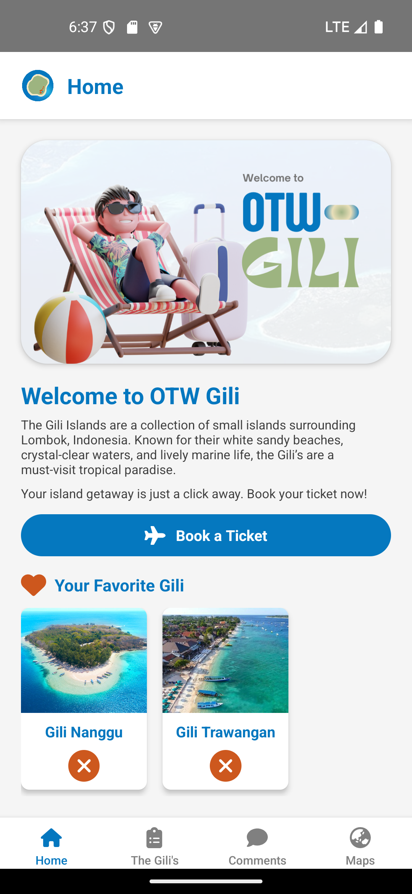
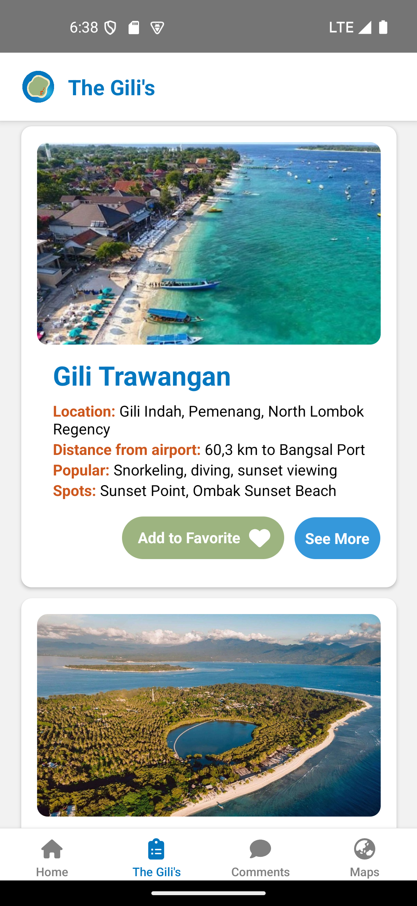
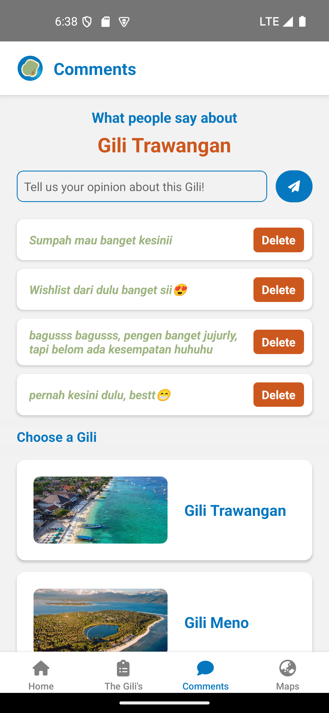
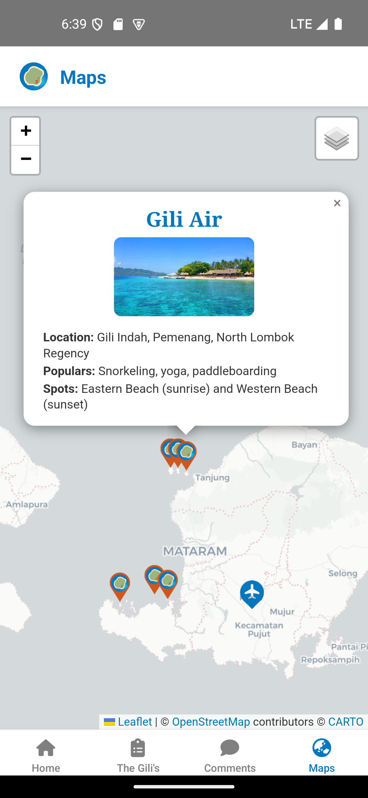

   
   <h1>Ready to Go? OTW-Gili!</h1>

**OTW-Gili** adalah aplikasi panduan wisata interaktif yang dirancang untuk membantu wisatawan menjelajahi keindahan Kepulauan Gili di Pulau Lombok. Aplikasi ini menyediakan informasi lengkap tentang destinasi wisata, peta interaktif, rekomendasi tempat populer, opini pengguna tentang masing-masing Gili, dan fitur navigasi langsung untuk memudahkan perjalanan.

## Komponen Pembangun Produk

   &nbsp; 
   &nbsp;
   &nbsp;
   &nbsp;
   &nbsp;
   &nbsp;
   &nbsp;
   &nbsp;
   &nbsp;
   &nbsp;
   &nbsp;
   &nbsp;

## Sumber Data

- **Informasi Gili, Foto, dan Link Tautan**: Dari pencarian **Google**.
- **Data Lokasi**: Dari **Google Maps**.

## Tangkapan Layar Produk

   
   

   
   

